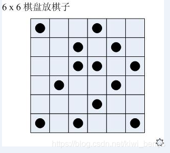

今有6×6的棋盘，其中某些格子已预放了棋子。
现在要再放上去一些，使得每行每列都正好有3颗棋子。
我们希望推算出所有可能的放法，下面的代码就实现了这个功能。
初始数组中，“1”表示放有棋子，“0”表示空白。请推测划线处的代码。



```c++
int N=0;
bool CheckStoneNum(int x[][6])
{ 
	for(int k=0;k<6;k++)
	{ 
		int NumRow=0,NumCol=0;
		for(int i=0;i<6;i++)
		{ 
			if(x[k][i]) NumRow++;
			if(x[i][k]) NumCol++;
		}
		if(_____________________) //     NumRow < 3 || NumCol < 3 
			return false;  //填空
	    }
	return true;
}

int GetRowStoneNum(int x[][6],int r)
{ 
	int sum=0;
	for(int i=0;i<6;i++) if(x[r][i]) 
		sum++;
	return sum;
}

int GetColStoneNum(int x[][6],int c)
{ 
	int sum=0;
	for(int i=0;i<6;i++) if(x[i][c]) 
		sum++;
	return sum;
}

void show(int x[][6])
{ 
	for(int i=0;i<6;i++)
	{ 
		for(int j=0;j<6;j++) 
			printf("%2d",x[i][j]);
        printf("\n");
    }
	printf("\n");
}

void f(int x[][6],int r,int c);
void GoNext(int x[][6],int r,int c)
{ 
	if(c<6)	_________________;  //填空    f(x, r, c + 1)
	else f(x,r+1,0);
}

void f(int x[][6],int r,int c)
{ 
	if(r==6)
	{ 
		if(CheckStoneNum(x)) 
		{ 
			N++;  
			show(x); 
		}
		return;
	}
	if(______________)  //填空，已经放有了棋子    x[r][c]
	{	 
		GoNext(x,r,c);  
		return; 
	}
	int rr=GetRowStoneNum(x,r);
	int cc=GetColStoneNum(x,c);
	if(cc>=3)  //本列已满
		GoNext(x,r,c);
	else if(rr>=3)  //本行已满
		f(x,r+1,0);
	else
	{	
		x[r][c]=1;  
		GoNext(x,r,c);  
		x[r][c]=0;
		if(!(3-rr>=6-c||3-cc>=6-r))  //本行或本列严重缺子，则本格不能空着！
			GoNext(x,r,c);
	}
}

int main(int argc,char *argv[])
{ 
	int x[6][6]={{1,0,0,0,0,0},{0,0,1,0,1,0},{0,0,1,1,0,1},{0,1,0,0,1,0},{0,0,0,1,0,0},{1,0,1,0,0,1}};
	f(x,0,0);
	printf("%d\n",N);
	return 0;
}
```